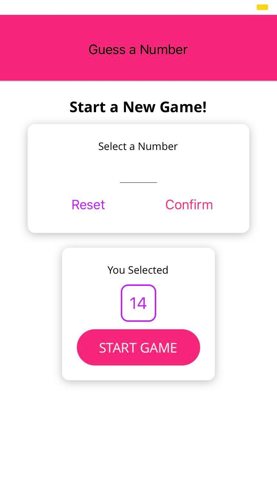

<h1 align="center">ReactNative-TheGuessGame</h1>
<a href="#">
  

    
  

</a>

## <h2 align = "center"> [Tap to see the video of this app](https://hirashahid.thecloudsoft.com/reactnative-theguessgame/)</h2>

## What I have learnt:
- [x] useState, useRef and useEffect.
- [x] Styling components.
- [x] Responsive and Adaptive user interfaces.
- [x] Built custom Button Component
- [x] ScrollView and FlatList
- [x] Styling Images and much more.
## What This App does:
- [x] This Game has 3 screens, the first one is the main screen where user enters any number between 1 and 99
- [x] After entering the number, a user would press the Start Game Button, the next screen will be popped up.
- [x] In this Screen, The app will guess the number and a user will help by telling if the number which is suggested is smaller or greater.
- [x] The guess list would also be shown to the user so that he can track the guesses.
- [x] When the guess is correct, the next screen will be appeared. And that’s the game over screen. Here user will also be told about how many guesses have been made to guess the correct number.
- [x] On this Screen, a user would also press the start new game button if he wants to play again.

## Author
You can get in touch with me on my LinkedIn Profile:

#### Hira Shahid

You can also follow my GitHub Profile to stay updated about my latest projects: 

If you liked the repo then kindly support it by giving it a star ⭐!

## LICENSE
- MIT (2021)
